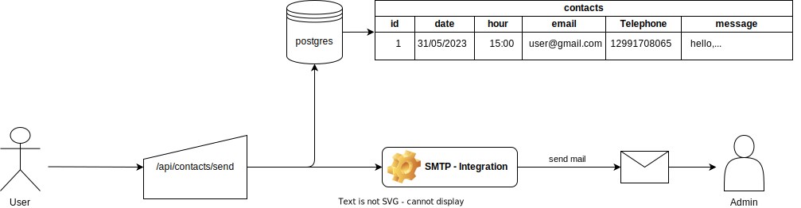

# CONTACTS API

This project is a simple contact api, where's integrate with postgres database and use SMTP integration to send mail to administrator.

## Run Local:
Command:
<pre>
$ npm install
$ npm run dev
</pre>

## Using docker:

Build:
<pre>
$ docker build -t contacts-api -f Dockerfile .
</pre>

Run:
<pre>
$ docker container run -d \
    -e
    -e
    -e 
    -e
    -e 
    -p80:80 \
    contacts-api  
</pre>

Image on my own docker repository:

<a href="">contacts-api</a>

