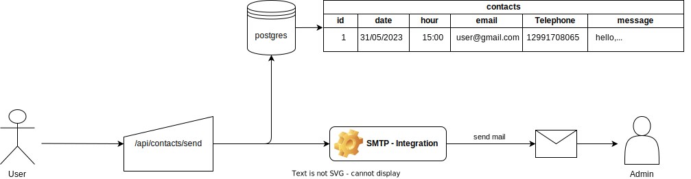

# CONTACTS API

This project is a simple contact api, where's integrate with postgres database and use SMTP integration to send mail to administrator.

## Run Local:
Command:
<pre>
$ npm install
$ npm run dev
</pre>

## Using docker:

Build:
<pre>
$ docker build -t contacts-api -f Dockerfile .
</pre>

Run:
<pre>
$ docker container run -d \
  -e PORT=8080 \
  -e DB_HOST=[POSTGRES IP OR HOST] \
  -e DB_PORT=5432 \
  -e DB_USER=[POSTGRES USER] \
  -e DB_PASSWORD=[POSTGRES PASSWORD] \
  -e DB_DATABASE=[POSTGRES DATABASE] \
  -e NODE_ENV=development
  -p80:80 \
  contacts-api  
</pre>

Image on my own docker repository:

<a href="">contacts-api</a>

